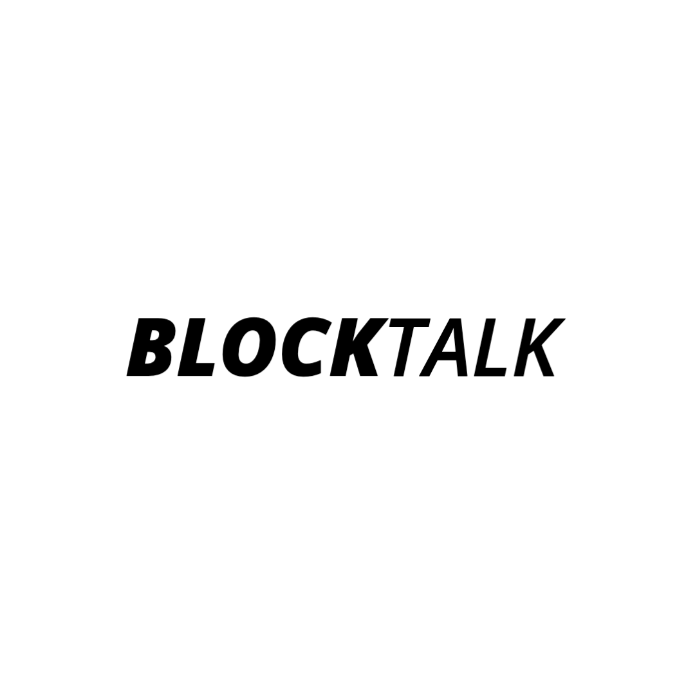

<div align="center">
  
</div>

<div align="center">
    <br>
    <p>A Snap Mini buiilt on React Native that allows users to create and share stories (by using the native camera to upload photos, take photos, or record videos) answering prompts about incarceration.</p>
</div>

## Mobile Screenshots (Taken on iPhone 12 Pro)
[Screenshots](https://github.com/asarelcastellanos/BLOCKTALK/blob/main/SCREENSHOTS.md)

## Demo
[Video of Prototype](https://youtu.be/ul8-pkm91-E)

## Features

- Ability to view and interact with other user's stories
- Create stories that respond to weekly prompt
  - Through video recordings or taking pictures
- Share stories with the feed
- View past prompts

## Tech Stack

**Client:** React Native & Expo

**Expo APIs:** App-loading, AV, Camera, Font, Image-Picker, Linear-Gradient, Location, Media-Library, Sharing, Status-Bar

**Server:** Firebase (FireStore & Storage)

## Want the base this was built on?

You can access the [base](https://github.com/asarelcastellanos/chatsnap) that this Snap Mini was built on top of.

## Additinal Files
 
In order for this app to run you will need a `fireabse.js` file that should look something like this: 

```javascript
import { initializeApp } from "firebase/app";
import { getFirestore } from "firebase/firestore";
import { getStorage } from "firebase/storage";

const firebaseConfig = {
  apiKey: [your info here],
  authDomain: [your info here],
  projectId: [your info here],
  storageBucket: [your info here],
  messagingSenderId:[your info here],
  appId: [your info here],
  measurementId: [your info here]
};

const app = initializeApp(firebaseConfig);
const db = getFirestore(app);
export default db;

```

## The Team

- Project Manager - [Kimbery Carrillo](https://www.linkedin.com/in/kimberly-carrillo-311bb5194/)
- Lead Marketer - [Andrea Zaragoza](https://www.linkedin.com/in/andreazaragozaaa/)
- Figma Manager - [Maddison Nielsen](https://www.linkedin.com/in/maddison-nielsen-899914232/)
- UI Designer - [Laura Melendez](https://www.linkedin.com/in/laura-melendez-a1a590213/)
- Lead Developer - [Asarel Casatellanos](https://www.github.com/asarelcastellanos)

## Run Locally

Clone the project

```bash
  git clone https://github.com/asarelcastellanos/BLOCKTALK
```

Go to the project directory

```bash
  cd BLOCKTALK
```

Install dependencies

```bash
  yarn install
```

Run on IOS

```bash
  expo start i
```

Run on ANDRIOD

```bash
  expo start a
```
